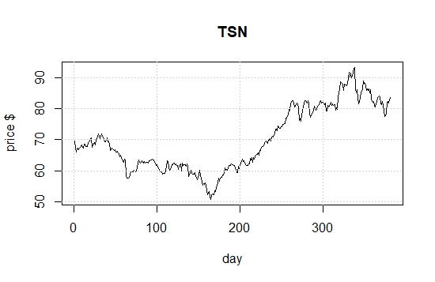

# Introduction
This is an implementation of a support vector machine designed to identify short-term stock price changes, based on previous stock parameters: open, low, high, close, volume

## Stock selected for this exercise:

<!-- put your justification/choice here: !-->


```{r setup, echo=FALSE, include=FALSE}
knitr::opts_chunk$set(echo = TRUE)
library(e1071)
```

## get data:
price.open	price.high	price.low	price.close	volume	price.adjusted	ret.adjusted.prices	ret.closing.prices	avgChange	Change

```{r}
tysonData = read.csv('tyson15.csv')
attach(tysonData)
# set up data frame
tysonDataFrame = data.frame(open=price.open, high=price.high,
        low=price.low, close=price.adjusted,volume= volume/10000, avg_change=avgChange, change =Change )
head(tysonDataFrame)
remove(tysonData)

```

```{r}
plot(tysonDataFrame)
```


## classification model, categorical response

### traditional interface:
```{r}
x <- subset(tysonDataFrame[1:377, ], select = -change)
y <- tysonDataFrame[1:377, ]$change
model1 <- svm(x, y) 

print(model1)
summary(model1)
```


## how well did the model fit?

```{r}
pred <- predict(model1, x)

# Check accuracy:
table(pred, y)
```

## decision values

```{r}
# compute decision values and probabilities:
pred <- predict(model1, x, decision.values = TRUE)
attr(pred, "decision.values")[1:6,]

# visualize (classes by color, SV by crosses):
plot(cmdscale(dist(tysonDataFrame[,-7])),
     col = as.integer(tysonDataFrame[,7]),xlab="normalized X", ylab = "$ change",
     pch = c("o","+")[1:150 %in% model1$index + 1])
legend('bottomleft',c('data','prediction'),pch=c('0','+'))
grid()

     
```


# train and test set:
There are 377 rows in my data set. The first 70 percent are rows 1-263, and they will be the training data.
The remaining 114 rows will be my test data set. 

```{r}
pctTrain=0.70
nObs = length(x[,1])
nTrain = round(pctTrain*nObs,0)
TrainSetIndex = 1:nTrain

# or ?
#TrainSetIndex = sample(1:nObs, nTrain)
```

## set up training set, test set

```{r}
# first the training set

XtrainSet = tysonDataFrame[TrainSetIndex,-7]
YtrainSet = tysonDataFrame$change[TrainSetIndex]
```

## get the model from training set.. 

```{r}
model2 <- svm(XtrainSet, YtrainSet) 

print(model2)
summary(model2)
```

## now the test set.. 

```{r}
XtestSet = tysonDataFrame[(nTrain:nObs),-7]
YtestSet = tysonDataFrame$change[nTrain:nObs]
```

## and evaluate with the test data

```{r}
pred2 <- predict(model2, XtestSet)
# And the accuracy..

table(pred2, YtestSet)
```

## tune

```{r}
stockTuned <- tune.svm(XtrainSet, YtrainSet, gamma = 2^(-1:1), cost = 2^(-1:4))

summary(stockTuned)
plot(stockTuned)
```

```{r}
#use optimized parameters... 
model3 <- svm(XtrainSet, YtrainSet, gamma=0.5, cost=4 ) 

print(model3)
summary(model3)
```

```{r}


pred3 <- predict(model3, XtestSet)
# And the accuracy..

table(pred3, YtestSet)

```
# SVM assignment

## complete an rmarkdown file on the stock you selected.   
  You will turn in the URL for your github accout that has the repo for this assignment.

### Identify the stock you use for this assignment.  
  Why did you choose this particular stock?  


```{r pressure, echo=FALSE, fig.cap="A caption", out.width = '100%'}

# Read CSV into R
MyData <- read.csv(file="tyson15.csv", header=TRUE, sep=",")
print(MyData)

```


### Use this template to get the SVM:  

  1. Training and Test sets:    
    I used 70 percent of the data as the training set. Rows 2 thru 263 made the first Test set and rows 264 thru 377 were used for the test dataset. I selected the training set to be chronological, and the testing set was the most recent availible data. I used chronological data because there was a lot of variance in the stock price of Tyson Foods Inc. I figured it would be hard to pin-point one observation that correlates to stock price. The one observable difference is that Tyson stock has risen steadily since its lowpoint at row 165 (12/24/2018) closing price 50.75. 

    
  2. How well did the SVM do?  
<!-- show the table of predicted vs truth for the whole data set, and then the same table for predicted vs actual results for just the test set.  !-->

  3. Optimal Gamma and costs are gamma .5  and cost 8, the lowest error was .06438746   

### Evaluate SVM performance     

  1. Did you exmine using other than the 'open', 'low', 'high', 'close' prices and volume as predictors? 
  I know that web-scraping programs can be run using Python, and taught how to scan for news about a company or pre-program sell offs if the stock drops too much value within a small period of time. I dont know how I would use the variables other than prices. Maybe volume fluctuations?
  
  2. Use the SVM you developed to predict stock moves on 16 - 20 Sept. 2019.  Compute the ROI assuming the SVM identifies an opportunity, (for example use around $1000 on each of the SVM predictions). Results are shown in Rows 347 thru 351 Sep 16 E Sept 17 D Sept 18 E Sept 19 D Sept 20 E. That means I made no investments on the three dates, and sold stock on two different other dates. According to my model, the downward trends had the least error in prediction. 
  
  3.  Would you put your own $$ in this SVM?  
    No, this SVM is effective as a learning tool but its predictive values aren't related to the changes in actual stock price. Too much confidence in the SVM would make me poor. 
  