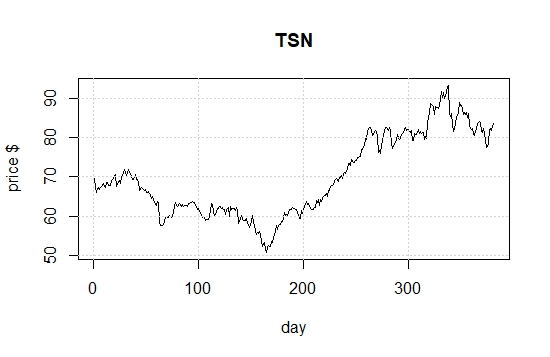

# Introduction
This is an implementation of a support vector machine designed to identify short-term stock price changes, based on previous stock parameters.This might be useful for day trades.

## Stock selected for this exercise:

I selected Tyson Foods, Inc the world's second largest producer and distributor of beef, chicken, and pork food products. Since population keeps rising, I think that big food companies like Tyson will have steady profits for long into the future. Tyson was founded in 1935, and has been a publicly traded company since 1963. It is a data rich company. 


```{r setup, echo=FALSE, include=FALSE}
knitr::opts_chunk$set(echo = TRUE)
library(e1071)
```

picture of the stock price

```{r fig.cap="HP price", echo=FALSE, out.width="100%"}

```

## get data: 
Name of the Columns
price.open	price.high	price.low	price.close	volume	price.adjusted	ref.date	ticker	ret.adjusted.prices	ret.closing.prices	pctChange	ChangeCategory

```{r}
tysondata = read.csv('tysonTrimmed.csv')
View(tysondata)

```

#set up data frame
```{r}
# set up data frame
    tysondataFrame = data.frame(open=tysondata$price.open, high=tysondata$price.high,  low=tysondata$price.low, close=tysondata$price.close,volume= tysondata$volume/10000, 
      change = tysondata$ChangeCategory )

# look at top and bottom..
head(tysondataFrame)
tail(tysondataFrame)
remove(tysondata)

```

```{r}
levels(tysondataFrame$change)
plot(tysondataFrame)
```


## classification model, categorical response
 
### traditional interface:
```{r}
x <- subset(tysondataFrame[1:356,], select = -change)
y <- tysondataFrame[1:356,]$change
model1 <- svm(x, y) 

#model1 is all the data
print(model1)
summary(model1)
```


## how well did the model fit?

```{r}
pred <- predict(model1, x)

# Check accuracy:
table(pred, y)
```

## decision values

```{r}
# compute decision values and probabilities:
pred <- predict(model1, x, decision.values = TRUE)
attr(pred, "decision.values")[1:6,]

# visualize (classes by color, SV by crosses):
plot(cmdscale(dist(tysondataFrame[,-6])),
     col = as.integer(tysondataFrame[,6]),xlab="normalized X", ylab = "weitghted change",
     pch = c("o","+")[1:150 %in% model1$index + 1])
legend('bottomleft',c('data','prediction'),pch=c('0','+'))
grid()

     
```


# train and test set:
There are 356 rows in my data set. I'm selecting 70 % of data randomly, and they will be the training data.
The remaining samples will be my test data set. 

```{r}
pctTrain=0.70  # use about 70% of the data
nObs = length(x[,1])
nObs = 356
nTrain = round(pctTrain*nObs,0)

# next line take data in order
#TrainSetIndex = 1:nTrain

# These lines take a random sample
scramble = sample(1:nObs)
TrainSetIndex = scramble[1:nTrain]
TestSetIndex = scramble[(nTrain+1):nObs]
```

## set up training set, test set

```{r}
# first the training set
tysondataFrame1 = tysondataFrame[1:356,]

XtrainSet = tysondataFrame1[TrainSetIndex,-6]
YtrainSet = tysondataFrame1$change[TrainSetIndex]
```

## get the model from training set.. 

```{r}
model2 <- svm(XtrainSet, YtrainSet) 

print(model2)
summary(model2)
```

## now the test set.. 

```{r}
XtestSet = tysondataFrame1[(TestSetIndex),-6]
YtestSet = tysondataFrame1$change[TestSetIndex]
```

## and evaluate with the test data

```{r}
pred2 <- predict(model2, XtestSet)
# And the accuracy..

table(pred2, YtestSet)
```

## tune

```{r}
stockTuned <- tune.svm(XtrainSet, YtrainSet, gamma = 2^(-2:1), cost = 2^(1:4))

summary(stockTuned)
plot(stockTuned)
print(paste('best parameters: gamma=',stockTuned$best.parameters[1], ', cost=', stockTuned$best.parameters[2]))
```

```{r}
#use optimized parameters... 
model3 <- svm(XtrainSet, YtrainSet, gamma=as.numeric(stockTuned$best.parameters[1]), cost=as.numeric(stockTuned$best.parameters[2] )) 

print(model3)
summary(model3)
```

```{r}


pred3 <- predict(model3, XtestSet)
# And the accuracy..

table(pred3, YtestSet)

```

Now use the last 11 values to see how we do

```{r}

XtestSetFortheMoney = tysondataFrame[346:356,-6]
YtestSetFortheMoney  = tysondataFrame[346:356,6]

pred4 <- predict(model3, XtestSetFortheMoney)
# And the accuracy..
print(pred4)

#table(pred4, YtestSetFortheMoney)

```
The actual results for Sept 16 - Sept 30 were 

346 347 348 349 350 351 352 353 354 355 356

D    E    D    E  E  E   D   D   D   D   D 

ROI = 8 wins - 3 errors would be a net gain of 5000 dollars if you get 1000 dollars for each correct prediction and lose 1000 if otherwise. 


```{r}
# compute decision values and probabilities:
pred <- predict(model3, XtestSet, decision.values = TRUE)
attr(pred, "decision.values")[1:5,]

# visualize (classes by color, SV by crosses):
plot(cmdscale(dist(XtestSet)),
     col = as.integer(YtestSet),xlab="normalized X", ylab = "weighted  change",
     pch = c("o","+")[1:150 %in% model3$index + 1])
legend('bottomright',c('data','prediction'),pch=c('0','+'))
grid()

```


# SVM assignment

## complete an rmarkdown file on the stock you selected.   
  url address
  https://github.com/jdwarp/SVMtemplate.git

### Identify the stock you use for this assignment.  
  The stock seemed to have a lot of variation, so I figured it would be worthwhile to test the predictive power of the support vector machine. 

### Use this template to get the SVM:  

  1. Training and Test sets:    
    I used 70 percent of the data as the training set. I randomized the selection of test data. I used randomization data because there was a lot of variance in the stock price of Tyson Foods Inc. Random data sets make more sense than randomly choosing one time to study based on chronological order. The one observable difference is that Tyson stock has risen steadily since its lowpoint at 12/24/2018 with a closing price $50.75.

```{r pressure, echo=FALSE, fig.cap="A caption", out.width = '100%'}

# Read CSV into R
#MyData <- read.csv(file="tysonTrimmed.csv", header=TRUE, sep=",")
#print(MyData)

```  
  
  2. How well did the SVM do?  
The SVM did well when predicting the date range from Sept 16th to Sept 30th. 
The SVM won 9 bets and lost 2, so it would have a positive ROI.


Predicted Data Set
```{r}
print(pred4)
```

Actual Data Set
The actual results for Sept 16 - Sept 30 were 
346 347 348 349 350 351 352 353 354 355 356
D   E   D   E   E   E   D   D   D   D   D 


  3. Tuning to SVM. The following are the best performing parameters for tuning the svm.
  
```{r}
print(paste('best parameters: gamma=',stockTuned$best.parameters[1], ', cost=', stockTuned$best.parameters[2]))
```

### Evaluate SVM performance     

  1. Did you exmine using other than the 'open', 'low', 'high', 'close' prices and volume as predictors? 
  I know that web-scraping programs can be run using Python, and taught how to scan for news about a company or pre-program sell offs if the stock drops too much value within a small period of time. I' dont know how I would use the variables other than prices. Maybe volume fluctuations?'m an Masters in Public Administration student, so my understanding of stock price variables is very limited. 
  
  2. Use the SVM you developed to predict stock moves on 16 - 20 Sept. 2019 which gave 11 days of information.  Compute the ROI assuming the SVM identifies an opportunity, (for example use around $1000 on each of the SVM predictions). 
Errors appeared on predictions for four days compared to actual results.
  
ROI = 9 wins - 2 errors. In this example I would gain 7000 dollars if you get 1000 dollars for each correct prediction and lose 1000 if otherwise. 

  3.  Would you put your own $$ in this SVM?  
    No, this SVM was training on its own self contained and incomplete data set so its good performance isn't consistent when you rerun the test. The SVM tool is effective as a learning tool but its predictive values aren't related to the all of the changes in the real world that impacts actual stock price. Too much confidence in the SVM would make me poor, and my computer isn't fast enough to run the necessary data. 
  

